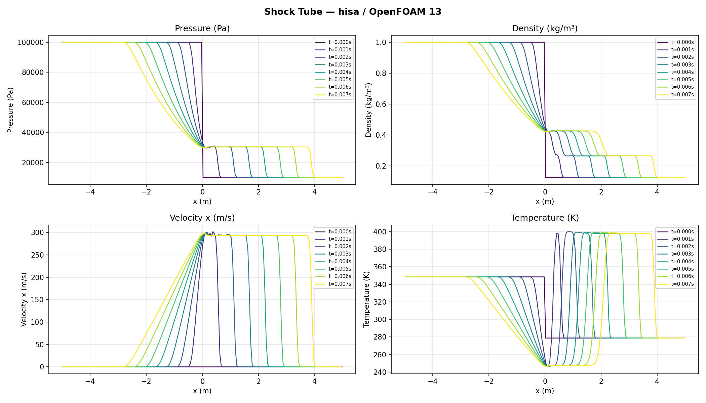
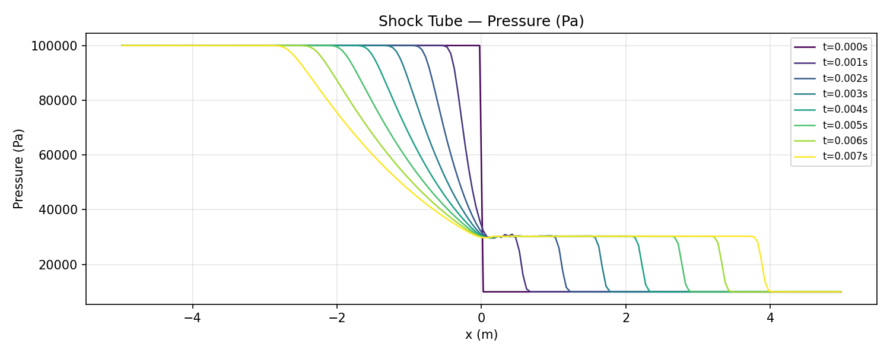
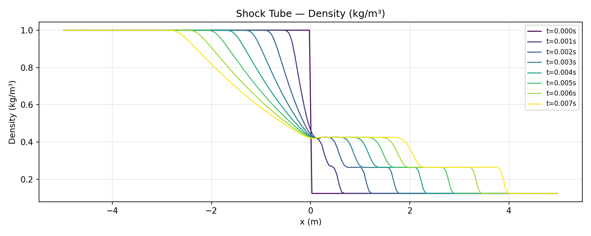
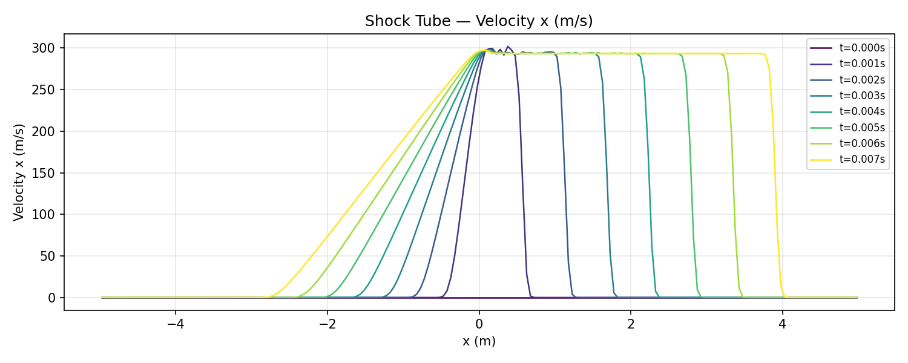
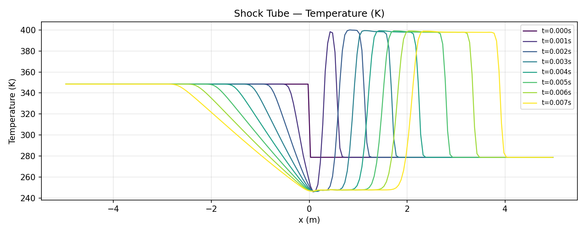

# Shock Tube — hisa / OpenFOAM 13

Classic Sod shock tube problem. Standard benchmark for 1D compressible flow solvers: validates shock propagation, contact discontinuity, and expansion fan against the exact Riemann solution.

---

## Software

| Component | Version |
|-----------|---------|
| OpenFOAM  | 13 (openfoam.org) |
| hisa      | 1.13.4 |
| Platform  | Ubuntu 24.04 / WSL2 |

---

## Problem Description

A tube of length 10 m is divided at x = 0 into high-pressure (left, x < 0) and low-pressure (right, x > 0) regions. At t = 0 the diaphragm bursts. Three wave structures develop:

- **Rightward-propagating shock wave**
- **Rightward-propagating contact discontinuity** (density/temperature jump, continuous pressure/velocity)
- **Leftward-propagating expansion fan**

The gas is air (dimensional, γ = 1.4, R = 287 J/(kg·K)).

---

## Domain and Mesh

```
side1 (left)                          side2 (right)
  x=-5                x=0                x=5
   │◄── high pressure ──►│◄── low pressure ──►│
   │    p=100000 Pa       │   p=10000 Pa       │
   │    T=348.432 K       │   T=278.746 K      │
```

- Domain: 10 m × 2 m × 2 m (1D — 1 cell in y and z)
- Mesh: 200 × 1 × 1 cells (uniform, dx = 0.05 m)
- Boundaries: `side1` and `side2` — zeroGradient (non-reflecting); `wall` — slip

---

## Initial Conditions

Set via `setFields`:

| Region | p (Pa) | T (K) | U (m/s) | ρ (kg/m³) |
|--------|--------|-------|---------|-----------|
| Left (x < 0) | 100,000 | 348.432 | (0,0,0) | ~1.001 |
| Right (x ≥ 0) | 10,000 | 278.746 | (0,0,0) | ~0.125 |

Density derived from perfect gas: ρ = p / (R·T), R = 287 J/(kg·K).

Pressure ratio: **10:1**. Temperature ratio: **~1.25:1**.

---

## Fluid Model

**Thermophysical model:** `hePsiThermo` — compressible, ψ-based.

**Equation of state:** Perfect gas.

**Transport:** Inviscid (μ = 0). Pure Euler equations.

**Gas properties (dimensional air):**

| Property | Value | Notes |
|----------|-------|-------|
| γ (gamma) | 1.4 | Cp/Cv = 1004.5 / 717.5 |
| Cp | 1004.5 J/(kg·K) | Air |
| Molecular weight | 28.96 g/mol | Air |
| R | 287 J/(kg·K) | Derived |
| μ | 0 | Inviscid |

---

## Boundary Conditions

| Patch | U | T | p |
|-------|---|---|---|
| side1 (left end) | zeroGradient | zeroGradient | zeroGradient |
| side2 (right end) | zeroGradient | zeroGradient | zeroGradient |
| wall (top/bottom/front/back) | slip | zeroGradient | zeroGradient |
| empty (front/back 2D planes) | empty | empty | empty |

`zeroGradient` on both ends acts as a non-reflective outflow for this short simulation duration (waves don't reach the boundaries before t = 0.007 s).

---

## Solver — hisa

### Flux scheme

```
fluxScheme    AUSMPlusUp;
```

AUSM+up — same as forwardStep case. Accurately resolves the sharp shock and contact discontinuity without excessive smearing.

### Reconstruction

```
reconstruct(rho)  wVanLeer;
reconstruct(U)    wVanLeer;
reconstruct(T)    wVanLeer;
```

Weighted Van Leer TVD limiter — second-order in smooth regions, first-order at discontinuities.

### Time integration

```
ddtSchemes { default dualTime rPseudoDeltaT CrankNicolson 0.9; }
adjustTimeStep  yes;
maxCo           1;
```

Adaptive time stepping with CFL = 1. Dual time-stepping with Crank-Nicolson (blending 0.9).

### Gradient scheme

```
gradSchemes { default faceLeastSquares linear; }
```

---

## Linear Solver

```
solver      GMRES;
inviscidJacobian  LaxFriedrichs;
preconditioner    LUSGS;
nKrylov           3;
solverTolRel      1e-1;
```

3 Krylov vectors (reduced from forwardStep — 1D problem converges faster). LU-SGS preconditioner.

---

## Pseudo-time Control

```
nPseudoCorr    20     (max inner iterations — tight, 1D converges in <10)
pseudoTol      1e-4   (tighter tolerance than forwardStep)
pseudoCoNum    1.0    (conservative initial CFL)
pseudoCoNumMax 100.0
```

---

## Run Control

| Parameter | Value |
|-----------|-------|
| Start time | 0 s |
| End time | 0.007 s |
| Adaptive deltaT | yes (maxCo = 1) |
| Write interval | 0.001 s |
| Processors | 1 (serial) |

Total wall time: ~1.6 s (serial, 200 cells).

---

## Results

Solution written at t = 0, 0.001, ..., 0.007 s.

| Quantity | Left (t=0) | Right (t=0) | Notes |
|----------|-----------|------------|-------|
| p | 100,000 Pa | 10,000 Pa | 10:1 ratio |
| T | 348.4 K | 278.7 K | |
| ρ | ~1.001 kg/m³ | ~0.125 kg/m³ | |
| U | 0 m/s | 0 m/s | |

At t = 0.007 s the shock has propagated rightward, the expansion fan leftward, and a contact discontinuity separates the two intermediate states.

### Combined profiles (all time steps)



### Individual field profiles

**Pressure**



**Density**



**Velocity**



**Temperature**



---

## Running the Case

```bash
source /opt/openfoam13/etc/bashrc
export PATH=$PATH:$HOME/OpenFOAM/$(whoami)-13/platforms/linux64GccDPInt32Opt/bin

bash /home/andrew/openfoam_jobs/openfoam-shockTube/runSim
```

To clean:
```bash
bash /home/andrew/openfoam_jobs/openfoam-shockTube/cleanSim
```

---

## Post-processing

```bash
source /home/andrew/openfoam_jobs/.venv/bin/activate
python /home/andrew/openfoam_jobs/openfoam-shockTube/plot_shockTube.py
```

Reads all time steps via pyvista `OpenFOAMReader`. Density at t=0 computed from perfect gas (ρ = p/RT) since `rho` field is not written at initial time. Profiles sampled along x-axis by sorting cell centres.

---

## References

- Sod, G.A. (1978). *A survey of several finite difference methods for systems of nonlinear hyperbolic conservation laws.* Journal of Computational Physics, 27(1), 1–31.
- hisa documentation: https://hisa.gitlab.io
- OpenFOAM 13: https://openfoam.org
